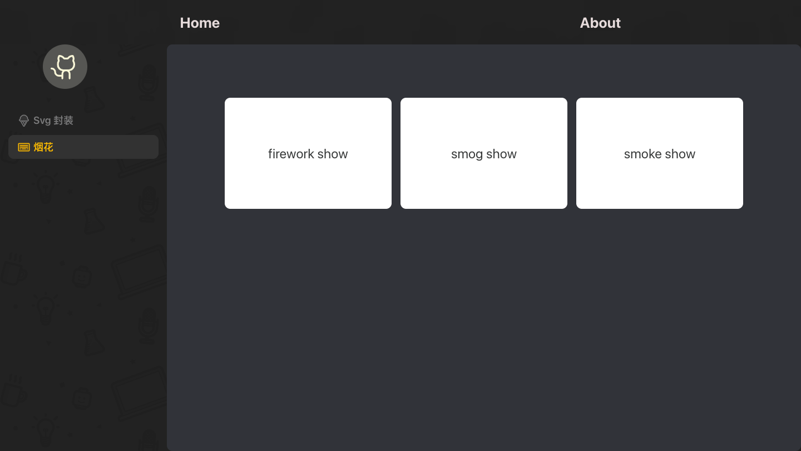
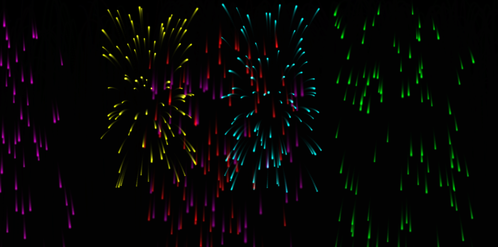
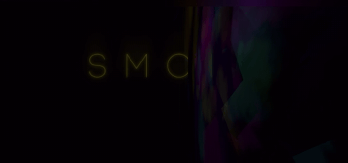

<h1 align="center">react 艺术特效</h1>
<br/>

<div align="center">
    
</div>
<br>

## 🔗 在线 Demo
- 烟花效果静态图
<div align="center">
    
</div>

- 烟雾旋转特效
<div align="center">
    
</div>

## 👨🏻‍💻 项目说明

-  基于React19+Typescript+threeJS实现烟花以及烟雾效果，添加粒子系统，并根据时间转换粒子不同颜色，并且为了更逼真，使用材质纹理，分片加载
- 本项目基于个人兴趣以及学习，未来探索更多3D效果并记录。


- Implementing fireworks and smoke effects based on React19+Typescript+ThreeJS, adding a particle system, and converting particles into different colors according to time. In order to be more realistic, material textures and shard loading are used

- This project is based on personal interests and learning, with the aim of exploring and documenting more 3D effects in the future.
## 🚀 技术栈

-   React v19
-   react-dom v19
-   TypeScript v4
-   webpack v5
-   react-router-dom v6
-   threeJS


## ⌛️ 安装项目依赖

-   `node` >= 16.0.0
-   `npm` >= 7.0.0
-   `yarn` >= 1.22.17

```
npm install
```
```
yarn
```
```
pnpm install
```

## 🚀 运行项目

```
npm
$ npm run start

yarn
$ yarn dev
```

## 📦 打包编译

```
npm run build:qa  // 测试环境
npm run build:prod  // 线上环境
```
